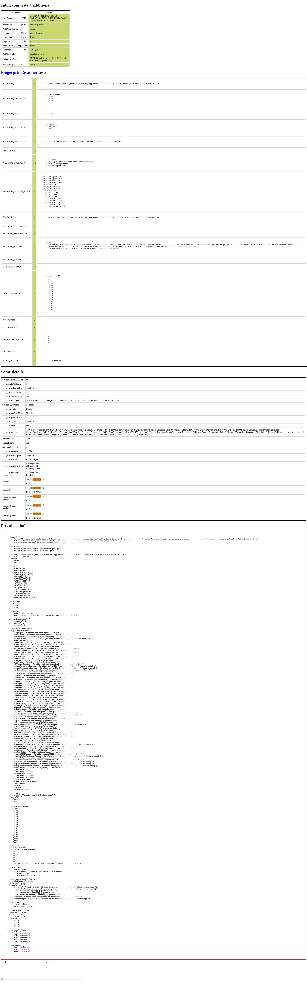

# pyppeteerstealth

A bunch of hacks from different websites

## Note!
- **Does not yet pass https://arh.antoinevastel.com/bots/areyouheadless** please help!
- Probably wont help where sites are using https://developer.mozilla.org/en-US/docs/Web/API/User-Agent_Client_Hints_API (`navigator.userAgentData.brands` etc)
- Designed to work with the puppeteer fetcher at https://changedetection.io
 
__**If you know what is missing, please make a PR!!!**__

If you compare loading https://arh.antoinevastel.com/bots/ in your application, versus in your browser you might be able
to see what is required to get the fingerprint closer to a "normal" browser (further away from a "headless" browser)

This is intended to be used with https://github.com/dgtlmoon/pyppeteer-ng and is also part of the 
https://changedetection.io project.

```python
browser = await pyppeteer_instance.connect(browserWSEndpoint="ws://127.0.0.1:3000",
                                           ignoreHTTPSErrors=True
                                           )

self.page = (pages := await browser.pages) and len(pages) or await browser.newPage()
# Should be set with setUserAgent
user_agent = next((value for key, value in request_headers.items() if key.lower().strip() == 'user-agent'), DEFAULT_USER_AGENT)
await self.page.setUserAgent(user_agent)

try:
    from pyppeteerstealth import inject_evasions_into_page
except ImportError:
    logger.debug("pyppeteerstealth module not available, skipping")
    pass
else:
    await inject_evasions_into_page(self.page)

response = await self.page.goto("https://example.com", waitUntil="load")
```

Last report from https://bot.sannysoft.com/




### Other related interesting projects/alternatives
- https://github.com/MeiK2333/pyppeteer_stealth

